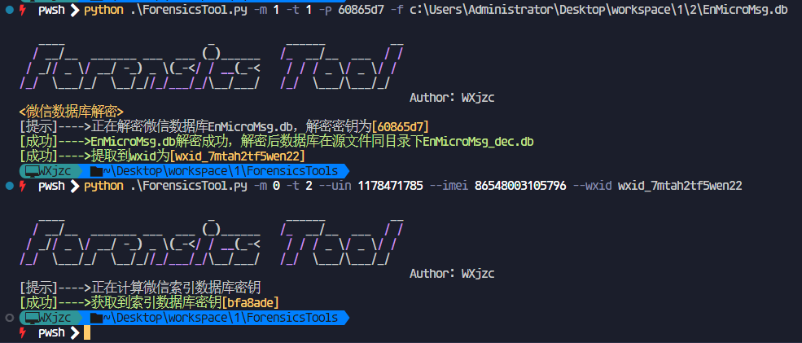
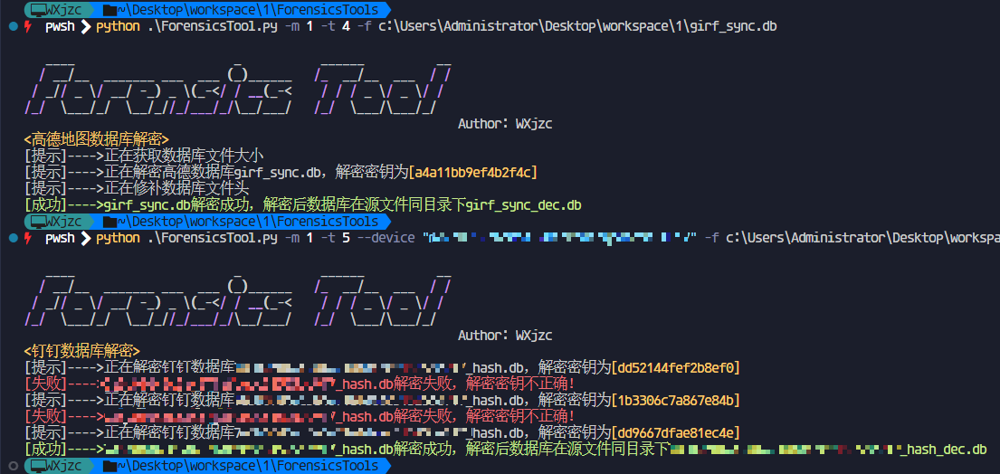
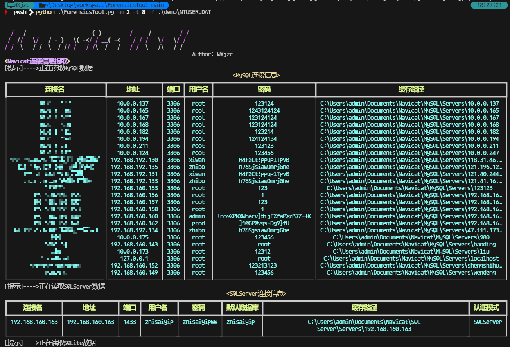
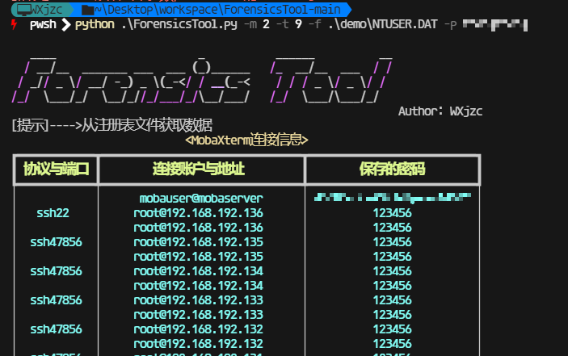
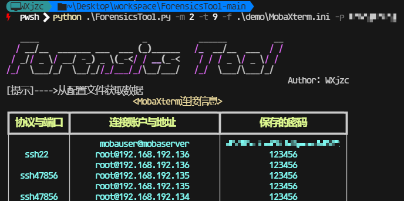
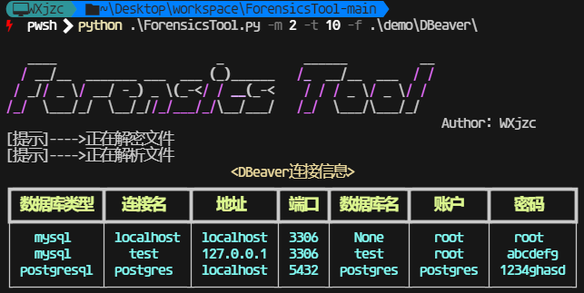
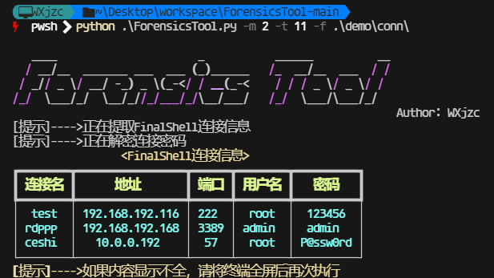

# 用法
1. `pip install -r requirements.txt`
2. `python3 ForensicsTool.py -h`
```
usage: ForensicsTool.py [-h] [-m MODE] [-f FILE] [-t TYPE] [-p PASSWORD] [--uin UIN] [--imei IMEI] [--wxid WXID] [--token TOKEN] [--device DEVICE] [--uid UID]

   ____                      _           ______          __
  / __/__  _______ ___  ___ (_)______   /_  __/__  ___  / /
 / _// _ \/ __/ -_) _ \(_-</ / __(_-<    / / / _ \/ _ \/ /
/_/  \___/_/  \__/_//_/___/_/\__/___/   /_/  \___/\___/_/
                                                            Author: WXjzc,b3nguang

optional arguments:
  -h, --help            show this help message and exit
  -m MODE, --mode MODE
                        指定需要运行的模式:
                            [0]表示计算密钥，支持的type值为1-3、13、16
                            [1]表示解密数据库，支持的type值为1、2、4-7、15、18
                            [2]表示数据提取，支持的type值为8-12、14、17
                            [3]Windows注册表解析，需要指定-f参数为注册表文件所在目录，目前需要SAM、SOFTWARE、SYSTEM及用户的NTUSER.DAT文件
                            [4]MetaMask解析，需要指定-f参数为persist-root文件路径
  -f FILE, --file FILE  指定需要处理的文件
  -t TYPE, --type TYPE
                        指定需要处理的内容:
                            [1]微信的EnMicroMsg.db
                            [2]微信的FTS5IndexMicroMsg_encrypt.db
                            [3]野火IM系应用的data
                            [4]高德的girf_sync.db
                            [5]钉钉的数据库
                            [6]SQLCipher4加密的数据库
                            [7]SQLCipher3加密的数据库
                            [8]Navicat连接信息提取，需指定-f为目标用户的注册表文件"NTUSER.DAT"
                            [9]MobaXterm连接信息解密，可以指定MobaXterm.ini配置文件或用户注册表文件"NTUSER.DAT"，解密需要给出主密码
                            [10]Dbeaver连接信息解密，指定-f为目标文件data-sources.json和credentials-config.json的父目录
                            [11]FinalShell连接信息解密，指定-f为目标文件夹conn，需要确保已经配置了JAVA_HOME环境变量
                            [12]XShell、XFtp连接信息解密，指定-f为目标文件夹session，并提供-p参数，值为计算机的用户名+sid
                            [13]默往APP的msg.db，计算密钥时提供--uid参数
                            [14]提取uTools的剪贴板数据，指定-f参数为剪贴板数据目录，-p为解密密钥，解密超级剪贴板的数据请指定-p参数值为super
                            [15]wcdb加密的数据库
                            [16]抖音的聊天数据库，计算密钥时提供--uid参数
                            [17]Hawk2.xml数据解密，指定-f参数为文件路径，-p参数为同目录下的crypto.KEY_256.xml或crypto.KEY_128.xml中的base64值
                            [18]ntqq数据库解密，指定-f参数位文件路径，--uid参数为对应qq号的uid

  -p PASSWORD, --password PASSWORD
                        解密的密码，处理钉钉和高德时不适用
  --uin UIN             微信用户的uin，可能是负值，在shared_prefs/auth_info_key_prefs.xml文件中_auth_uin的值
  --imei IMEI           微信获取到的IMEI或MEID，在shared_prefs/DENGTA_META.xml文件中IMEI_DENGTA的值，在高版本中通常是1234567890ABCDEF，可以为空
  --wxid WXID           数据库所属的wxid，一般情况下在解密EnMicroMsg.db的时候会一并提取，若无需要，请从shared_prefs/com.tencent.mm_preferences.xml中提取login_weixin_username的值
  --token TOKEN         野火IM系应用的用户token，shared_prefs/config.xml的token的值
  --device DEVICE       钉钉解密需要的内容，通常在shared_prefs/com.alibaba.android.rimet_preferences.xml中带有数据库名的字段的值中出现，如HUAWEI P40/armeabi-v7a/P40/qcom/HUAWEIP40
  --uid UID             默往（通常在shared_prefs/im.xml中的userId的值）、抖音（数据库文件名中的id）计算密钥需要的内容、QQ（msf_mmkv_file中QQ号对应的uid）
```

# 样例
















# 声明
本工具仅用于电子数据取证的学习与研究，请勿用于非法用途，否则后果自负。
