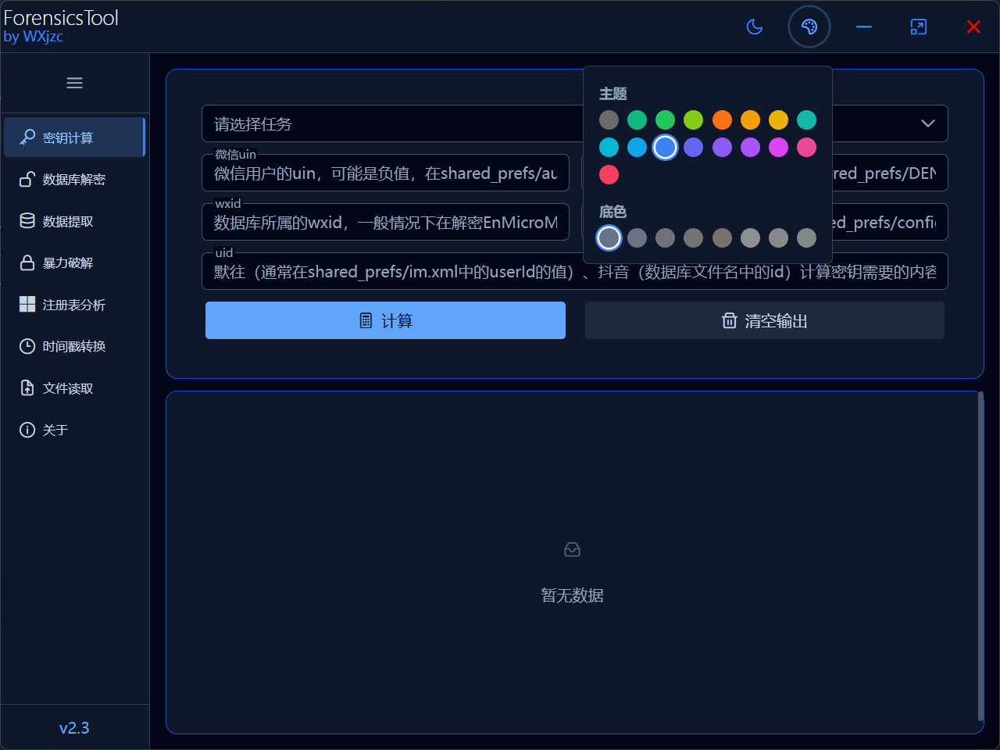
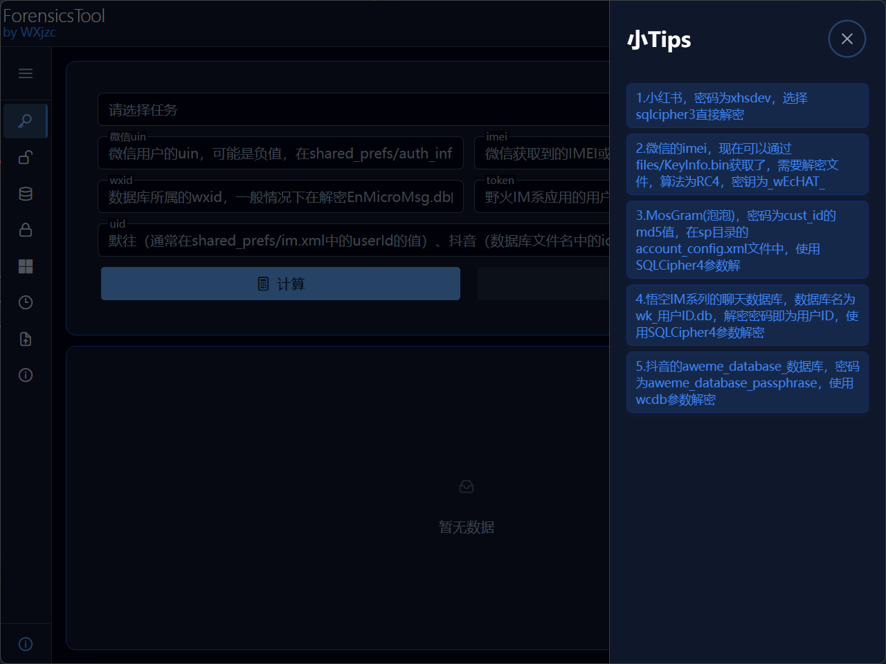

# 说明
这是ForensicsTool的Go版本，使用`Wails V2`进行了重构，使用方式和之前一致，有需要的可以自己编译，`wails build`即可

包含安卓端（SQLite数据库等）、windows端（注册表、远程管理工具等）、时间戳、暴力破解等功能。

菜单栏现在可以收缩，小提示现在从右侧弹出

为了完成这个项目，fork并修改了几个库，用于适配分析
* https://github.com/WXjzcccc/registry
* https://github.com/WXjzcccc/go-sqlcipher
* https://github.com/WXjzcccc/go-mmkv

# 声明

本工具仅用于电子数据取证的学习与研究，请勿用于非法用途，否则后果自负。
